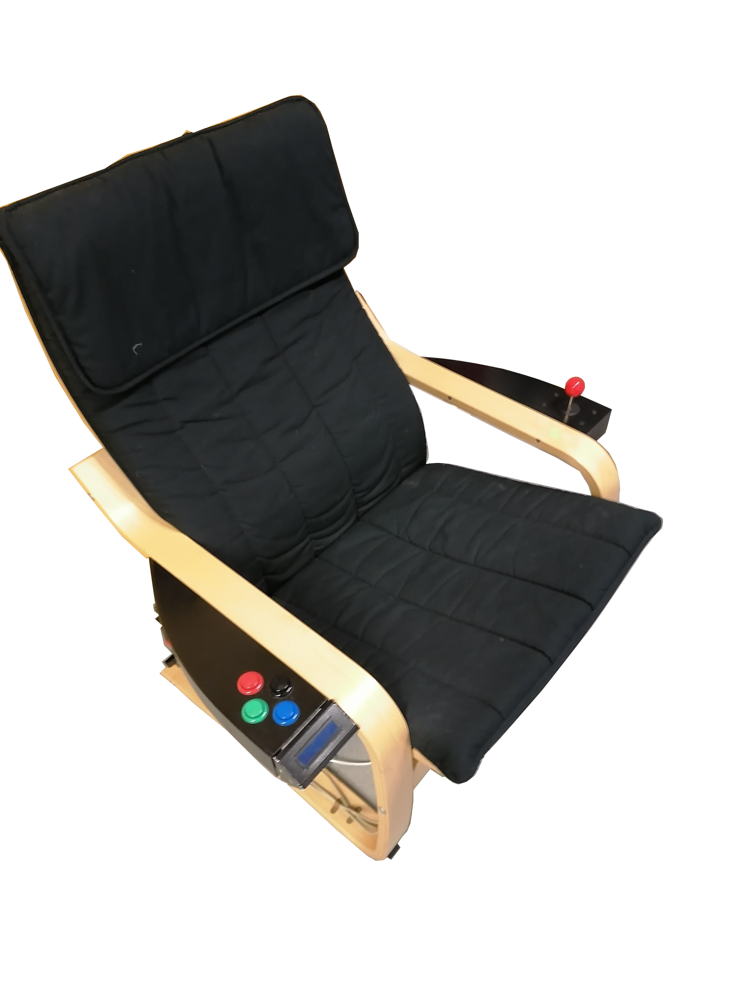
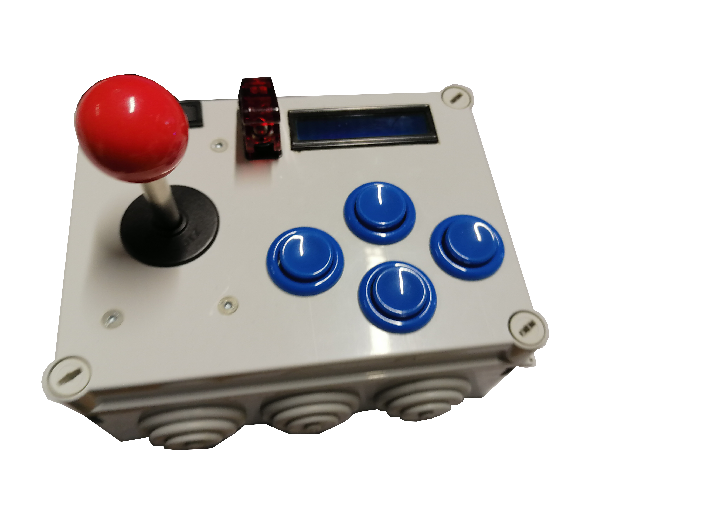

# Arcade Controllers

The code of all the hardware can be found in the cortrect directory. Also the pi scripts can be found there.

## Player (Seat)

### Player Arduino PRO-Micro Pinout

- Joystick
  - up: 3
  - down: 2
  - left: 5
  - right: 4
- Arcade buttons
  - up: 6
  - down: 7
  - left: 9
  - right: 8
- Coin collector: A0

## Defender (launchbox)

### Defender Arduino PRO-Micro Pinout

- Joystick
  - up: 5
  - down: 3
  - left: 2
  - right: 4
- Arcade buttons
  - up: 7
  - down: 9
  - left: 6
  - right: 8
- KILL-Switch: 10

### Debug mode on the Launchbox

- step 1: press left + right button
- step 2: open killswitch cap
- step 3: move joystick down
- step 4: while pressing buttons and holding joystick: activate killswitch

The controller then presses "CTRL+ALT+F1" to enter tty1 (terminal) and executes the debugMenu.sh script from desktop.

When the killswitch is disarmed, the controller presses "CTRL+ALT+F7" to change to desktop.

## Raspberry pi

### replicating the project

1. install raspbean full with sudo apt update/upgrade,...
2. follow [this tutorial](https://pimylifeup.com/raspberry-pi-kiosk/).
3. paste the debugMenu.sh, Kiosk.sh and the updateRepo.sh on the desktop.
4. open terminal cd to desktop, do git clone "phaser repo" directly to the desktop.
5. install apache or another webserver.
6. set the webserver host directory (httpd) inside the cloned git repo
7. when the Kiosk.sh is executed, Chromium will open in kiosk mode. (everything can be controlled by executing the debugMenu.sh script from the desktop. or via entering debugmode from the controller).
