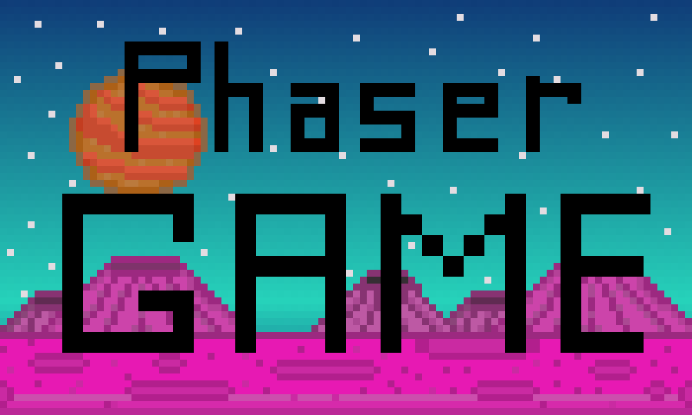
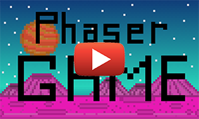
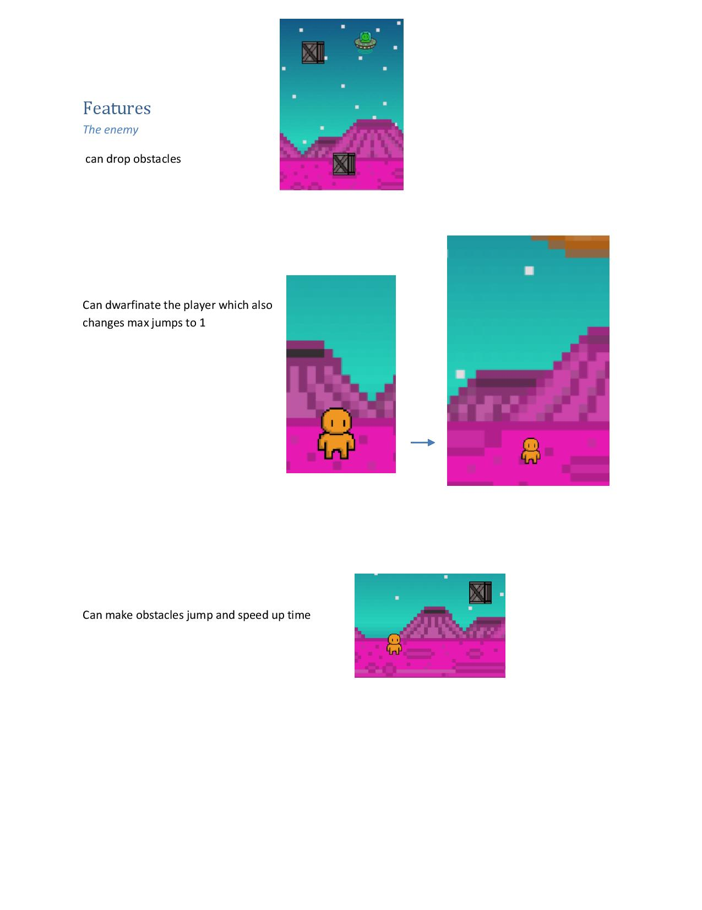
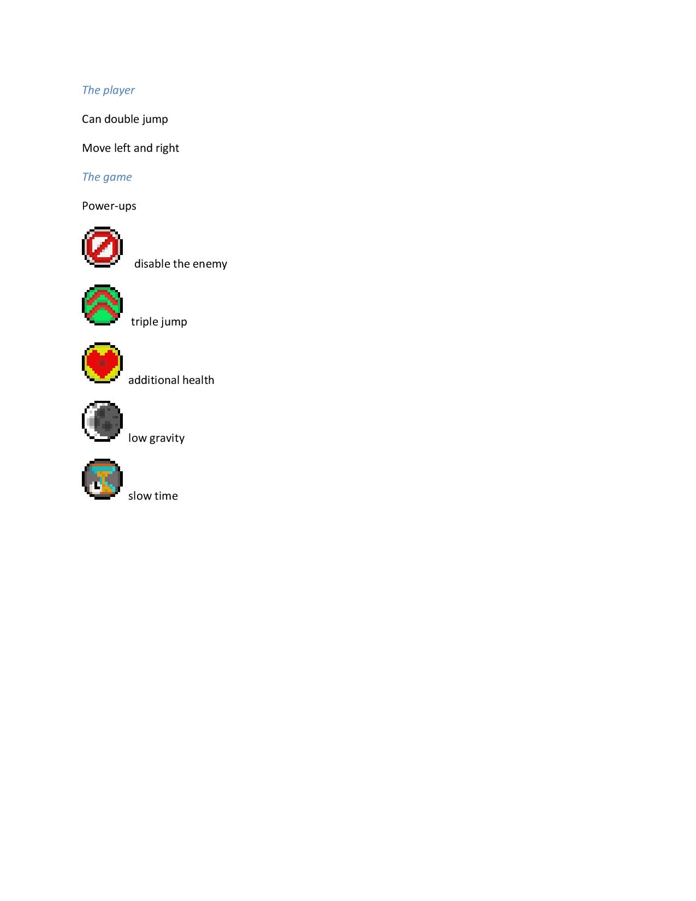
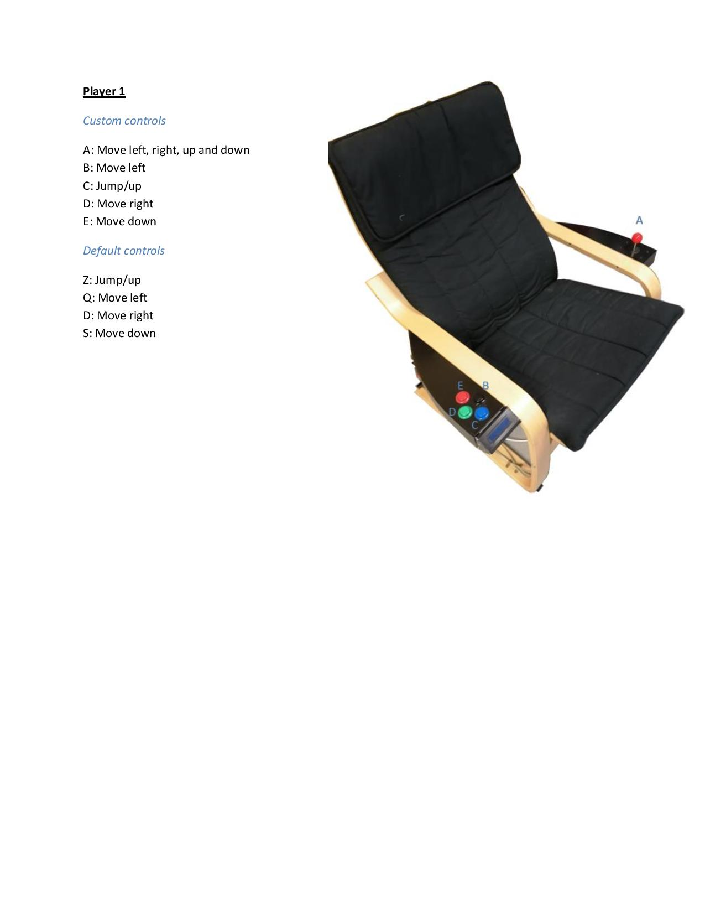
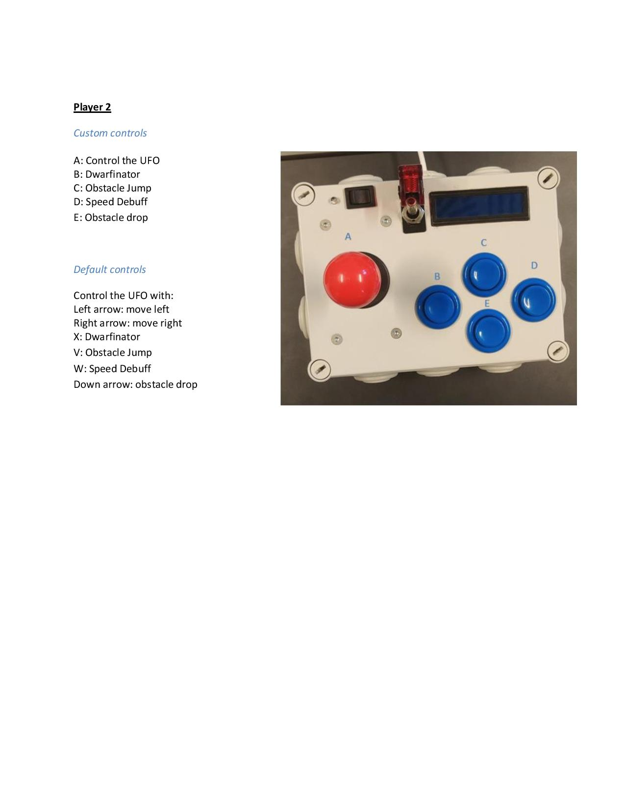

# Phaser Game

## About

- [Game-URL](https://phaser.ml)
- [Final video](https://www.youtube.com/watch?v=s3fNe2pG_wg)
- [First concept (the concept before beginning in phaser)](concept.md)
- [Hardware (extra info)](./Hardware)
- [Features and controlls](./features.pdf)

Our idea is to make an infinite runner game. Where the objective is to get the character as far as possible while avoiding obstacles (and collect coins). But with a twist, this endless runner can be played with a friend, they can try to stop you by dropping obstacles and activating debuffs.

We chose an endless runner because you can start very simple and build up from there.

Some endless runners are very well-known for their addictiveness, like Subway Surfers, Temple Run, Jetpack Joyride, Flappy Bird and the Google Dinosaur Game (when you don’t have an internet connection in Chrome).

### Team members

- [Arno Schoutteten](https://github.com/vives-projectweek-2021/projectweek21-report-madness007)
- [Aaron Van Vyve](https://github.com/vives-projectweek-2021/projectweek21-report-AaronVanV)
- [Henry Buysschaert](https://github.com/vives-projectweek-2021/projectweek21-report-HenryBuyssie)

## Controls & features

## Game facts

### Physics

- Flat plain with obstacles
- Changeable gravity
- player 1 can jump, move left and right
- Double jump
- Player 2 that can drop obstacles

### Powerups

#### Buffs

- Low gravity
- Slow time
- Triple jump
- Extra life
- Disable player 2
- Coins (extra points)

#### Debuffs

- Speed up time
- Dwarfinator (smaller character) + Single jump
- Make obstacles jump

### Theme (graphics)

- Space including a planet, aliens, a UFO, boxes & craters

## Visual

### Start menu

- Play
- The player needs to insert a coin to start

#### Game header

- Current score
- Timer
- Disable player 2 timer
- Distance
- Powerup timer
- Debuff timer
- Drop obstacle timer

## Hosting

Phaser can be hosted from netlify, Because the webpage is static.

The only downside is that it takes a long time to load the phaser framework. witch is 6Mb.
The game will also be hosted local on a raspberry pi. The pi will be installed with kiosk mode. The player can play on the pi with the controllers and a screen.

You can also just git clone this repo and localhost the game.

## Tasks

 |Tasks (game)                                                                          |Done by:   |
 |:-------------------------------------------------------------------------------------|:----------|
 |phaser basic game setup                                                               |Aaron      |
 |find a good no copyrighted background track                                           |Henry      |
 |install background audio                                                              |Arno       |
 |player 1 jump & gravity                                                               |Aaron      |
 |player 2 movement                                                                     |Aaron      |
 |player 1 left right                                                                   |Arno       |
 |visuals (sprites, background, buffs, obstacles, ...)                                  |Aaron      |
 |convert main.js to multiple scenes                                                    |Arno       |
 |create loading assets and menu scenes                                                 |Arno       |
 |add 2 seconds delayed start for performance                                           |Arno       |
 |publish to netlify and create lifetime free domain name                               |Arno       |
 |add pi.html with a second main£.js with limited frame rate for the pi                 |Arno       |
 |edit final video in premiere pro                                                      |Arno       |
 |player 2 dropping obstacles every 3 seconds                                           |Aaron      |
 |border offscreen deleting object when offscreen                                       |Aaron      |
 |obstacles and coins spawn on random location offscreen and move towards player 1      |Aaron      |
 |show timers onscreen                                                                  |Aaron      |
 |player 1 powerup coding                                                               |Henry      |
 |implementing double jump mechanic                                                     |Henry      |
 |ability and debuff timer                                                              |Henry      |
 |random power spawner                                                                  |Henry      |
 |                                                                                      |           |
 |                                                                                      |           |
 |                                                                                      |           |

 |Tasks (buffs)                                                                         |Done by:   |
 |:-------------------------------------------------------------------------------------|:----------|
 |triple jump                                                                           |Henry      |
 |extra life                                                                            |Henry      |
 |disable player 2                                                                      |Aaron      |
 |slow time                                                                             |Henry      |
 |low gravity                                                                           |Henry      |
 |                                                                                      |           |
 |                                                                                      |           |
 |                                                                                      |           |

 |Tasks (debuffs)                                                                       |Done by:   |
 |:-------------------------------------------------------------------------------------|:----------|
 |dwarfinator                                                                           |Henry      |
 |obstacle jump                                                                         |Aaron      |
 |speed up time                                                                         |Aaron      |
 |                                                                                      |           |
 |                                                                                      |           |
 |                                                                                      |           |
 |                                                                                      |           |
 |                                                                                      |           |

 |Tasks (Hardware)                                                                      |Done by:   |
 |:-------------------------------------------------------------------------------------|:----------|
 |install pi with chromium kiosk mode                                                   |Arno       |
 |make update repo, kiosk and debugmenu shell scripts                                   |Arno       |
 |add arduino to the player 1 controller                                                |Arno       |
 |add arduino to the player 2 controller                                                |Arno       |
 |finish controllers, killswitch, rewire,...                                            |Arno       |
 |make a debugmenu keystroke sequence                                                   |Arno       |
 |add coin acceptor with voltage devider an analise analog signals with arduino         |Arno       |
 |map all the buttons and code the arduinos                                             |Arno       |

## Hardware, software & used technologies

- Hardware: 2 arcade controllers (seat & mobile controller)
- Hardware: arduino pro micro (inside the controllers)
- Hardware: raspberry pi (playing the game in kiosk mode)
- Software: Visual Studio Code (code editor)
- Software: arduino ide (code editor & compiler)
- Software: Visual Studio Code (code editor)
- Software: Piskel (pixel art)
- Language: JavaScript using Phaser (Framework)
- Language: html, css
- Language: arduino
- Language: bash (raspberry pi scripts)

## Links/ bibliography

[Phaser Tutorial 1](https://www.youtube.com/watch?v=uxos1GG32Tg)

[Phaser 3: Making your first game](https://phaser.io/tutorials/making-your-first-phaser-3-game/part1)

[Complete Course Phaser 1hour](https://www.youtube.com/watch?v=hI_LS8bdkM4)

[Example endless runner](https://www.emanueleferonato.com/2019/01/23/html5-endless-runner-built-with-phaser-and-arcade-physics-step-5-adding-deadly-fire-being-kind-with-players-by-setting-its-body-smaller-than-the-image/)

[Raspberry pi kiosk mode](https://pimylifeup.com/raspberry-pi-kiosk/)

[Piskel tutorials](https://www.youtube.com/playlist?list=PLO3K3VFvlU6Akj3W29_nMLZFnwNOVbAzI)
